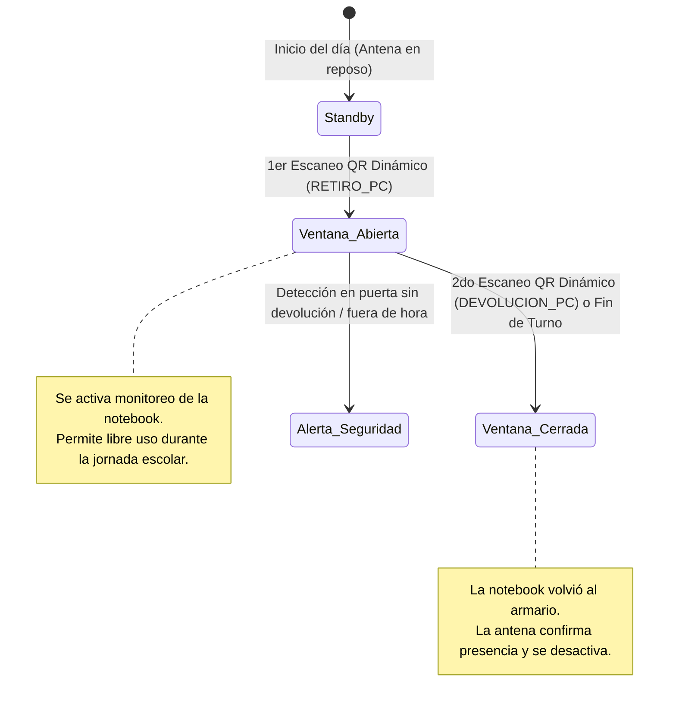

# Guía de Comunicación Antena RFID UHF ↔ ESP32 ↔ Sistema IPF SmartTrack

Guía técnica detallada para implementar la comunicación entre una **antena parche de polarización lineal**, un **microcontrolador ESP32** con módulo lector UHF, y el **Backend/Dashboard** del sistema IPF SmartTrack.

---

## 1. Arquitectura General y Flujo de Datos

```
[ Tag RFID UHF en Notebook ]
             │ (Onda electromagnética 902 - 928 MHz EPC Gen2)
             ▼
[ Antena Parche (Polarización Lineal) ]
             │ (Cable coaxial SMA / u.FL)
             ▼
[ Módulo Lector UHF (ej. YRM100 / M6E Nano / JRD-4035) ]
             │ (Conexión UART Serie: 3.3V TX/RX)
             ▼
[ Microcontrolador ESP32 ]
             │ (Wi-Fi 802.11 b/g/n - Red Local del Aula)
             ▼
[ Backend FastAPI: POST /api/rfid/eventos ]
             │ (SQLAlchemy Async / PostgreSQL)
             ▼
[ Dashboard Frontend (React + Vite) ]
```

---

## 2. Componentes de Hardware y Conexiones

### 2.1 Materiales Necesarios
1. **Antena Parche UHF con Polarización Lineal:**
   * Rango de frecuencia: **902 – 928 MHz** (Banda Argentina / US915).
   * Ganancia recomendada: **6 dBi a 9 dBi**.
   * Conector: SMA macho / hembra.
2. **Módulo Transceptor RFID UHF (Lector):**
   * Modelos compatibles: **MagicRF M100 / YRM100**, **ThingMagic M6E Nano**, o módulos basados en **JRD-4035 / PR9200**.
   * Protocolo: ISO 18000-6C / EPC Class 1 Gen 2.
3. **Placa de desarrollo ESP32:**
   * ESP32 NodeMCU / ESP32-WROOM-32 con conexión Wi-Fi integrada.
4. **Fuente de Alimentación:**
   * La emisión de radiofrecuencia UHF a 26–30 dBm consume picos de hasta 1 A a 5V. **No alimentar el módulo UHF directamente del pin 3.3V del ESP32**; usar fuente externa o pin VIN de 5V (mínimo 2A) con tierras comunes (GND compartida).

### 2.2 Diagrama de Pines (Pinout)

| Pin Módulo Lector UHF | Pin ESP32 | Descripción |
|---|---|---|
| **VCC** | 5V / VIN (o fuente externa 5V) | Alimentación principal del lector |
| **GND** | GND | Tierra común compartida |
| **TX (Lector)** | **GPIO 16 (RX2)** | Datos transmitidos por el lector al ESP32 |
| **RX (Lector)** | **GPIO 17 (TX2)** | Comandos enviados desde el ESP32 al lector |
| **EN / RST** (si tiene) | GPIO 4 o 3.3V | Habilitación del módulo |
| **R-ANT (RF Out)** | Cable SMA a Antena Parche | Salida de radiofrecuencia a la antena |

---

## 3. Particularidad Clave: Polarización Lineal

> ⚠️ **IMPORTANTE: Alineación física de la antena y el tag**
> * Una antena de **polarización lineal** concentra su energía en un solo plano (horizontal o vertical), ofreciendo **mayor alcance** que una circular a igual potencia.
> * **Requisito crítico:** El eje largo del chip/antena del **tag RFID pegado en la notebook** debe coincidir con el plano de polarización de la antena parche.
> * Si la antena emite con polarización **vertical**, el tag debe entrar en forma **vertical**. Si queda perpendicular (rotado 90°), la pérdida de señal supera los 20 dB y el tag no será leído.

---

## 4. Estructura de Datos en el Backend (API)

El backend de IPF SmartTrack ya cuenta con el endpoint preparado para recibir lecturas de antenas:

* **Endpoint:** `POST http://<IP_BACKEND>:8000/api/rfid/eventos`
* **Content-Type:** `application/json`

### Formato del Payload JSON (enviado por el ESP32)

```json
{
  "tag_rfid": "44225502",
  "tipo_evento": "lectura_antenna",
  "lector_id": 1
}
```

### Campos requeridos:
| Campo | Tipo | Ejemplo | Descripción |
|---|---|---|---|
| `tag_rfid` | String | `"44225502"` o `"E280116060000204"` | EPC o identificador leído del tag RFID |
| `tipo_evento` | String | `"lectura_antenna"` | Identifica que la lectura provino de la antena fija |
| `lector_id` | Integer | `1` | ID del lector en base de datos (`rfid_lectores`) |

---

## 5. Firmware para el ESP32 (Arduino / C++)

Este código implementa:
1. Conexión automática al Wi-Fi de la red local.
2. Lectura periódica del módulo UHF por el puerto serie `UART2`.
3. **Filtro antirrebotación (Debounce):** Evita inundar el backend si una notebook se queda quieta frente a la antena (espera 5 segundos antes de volver a reportar el mismo tag).
4. Envío HTTP POST en formato JSON al backend de IPF SmartTrack.

```cpp
#include <WiFi.h>
#include <HTTPClient.h>
#include <ArduinoJson.h>

// ==========================================
// CONFIGURACIÓN DE RED Y SERVIDOR
// ==========================================
const char* WIFI_SSID     = "WIFI_AULA";          // Nombre de red Wi-Fi
const char* WIFI_PASSWORD = "PASSWORD_WIFI";       // Contraseña Wi-Fi

// Dirección IP del Backend en la red local (puerto 8000)
const char* BACKEND_URL   = "http://192.168.2.101:8000/api/rfid/eventos";
const int   LECTOR_ID     = 1;                    // ID del lector configurado en la DB

// ==========================================
// CONFIGURACIÓN DE PINES UART (Lector UHF)
// ==========================================
#define RXD2 16  // Conectar al TX del módulo UHF
#define TXD2 17  // Conectar al RX del módulo UHF
HardwareSerial rfidSerial(2);

// Filtro antirrebotación
String ultimoTagLeido = "";
unsigned long tiempoUltimaLectura = 0;
const unsigned long TIEMPO_ESPERA_REPETIDO_MS = 5000; // 5 segundos

// Comando estándar para pedir inventario a módulos UHF basados en MagicRF / YRM100
// Trama: Header(BB) + Type(00) + Command(22) + Length(00 00) + Checksum(22) + End(7E)
const uint8_t COMANDO_INVENTARIO[] = {0xBB, 0x00, 0x22, 0x00, 0x00, 0x22, 0x7E};

void setup() {
  Serial.begin(115200);
  rfidSerial.begin(115200, SERIAL_8N1, RXD2, TXD2);

  Serial.println("\n[RFID] Iniciando ESP32 SmartTrack RFID Gateway...");
  conectarWiFi();
}

void loop() {
  // 1. Verificar estado de Wi-Fi
  if (WiFi.status() != WL_CONNECTED) {
    conectarWiFi();
  }

  // 2. Enviar comando de escaneo al módulo UHF cada 300 ms
  static unsigned long ultimaPeticion = 0;
  if (millis() - ultimaPeticion > 300) {
    ultimaPeticion = millis();
    rfidSerial.write(COMANDO_INVENTARIO, sizeof(COMANDO_INVENTARIO));
  }

  // 3. Procesar respuesta del lector UHF
  if (rfidSerial.available()) {
    String tagEPC = procesarRespuestaLector();

    if (tagEPC.length() > 0) {
      unsigned long ahora = millis();
      // Filtrar lecturas repetidas consecutivas dentro del tiempo de espera
      if (tagEPC != ultimoTagLeido || (ahora - tiempoUltimaLectura > TIEMPO_ESPERA_REPETIDO_MS)) {
        ultimoTagLeido = tagEPC;
        tiempoUltimaLectura = ahora;
        
        Serial.printf("[RFID] Tag detectado: %s. Enviando al backend...\n", tagEPC.c_str());
        enviarAlBackend(tagEPC);
      }
    }
  }
}

void conectarWiFi() {
  Serial.printf("[WIFI] Conectando a %s", WIFI_SSID);
  WiFi.mode(WIFI_STA);
  WiFi.begin(WIFI_SSID, WIFI_PASSWORD);

  int intentos = 0;
  while (WiFi.status() != WL_CONNECTED && intentos < 20) {
    delay(500);
    Serial.print(".");
    intentos++;
  }

  if (WiFi.status() == WL_CONNECTED) {
    Serial.printf("\n[WIFI] Conectado. IP Asignada: %s\n", WiFi.localIP().toString().c_str());
  } else {
    Serial.println("\n[WIFI] Error al conectar. Reintentando...");
  }
}

String procesarRespuestaLector() {
  // Buffer para capturar la trama del lector
  uint8_t buffer[64];
  int len = 0;

  while (rfidSerial.available() && len < sizeof(buffer)) {
    buffer[len++] = rfidSerial.read();
    delay(2);
  }

  // Verificar cabecera típica de respuesta (ej. 0xBB 0x02 ...)
  if (len >= 8 && buffer[0] == 0xBB) {
    // Extraer bytes correspondientes al EPC (según especificación del fabricante)
    // Ejemplo: EPC ubicado entre offset 6 y 18
    String epcHex = "";
    int epcLen = buffer[3]; // Longitud de datos
    for (int i = 5; i < 5 + epcLen && i < len - 2; i++) {
      if (buffer[i] < 0x10) epcHex += "0";
      epcHex += String(buffer[i], HEX);
    }
    epcHex.toUpperCase();
    return epcHex;
  }
  return "";
}

void enviarAlBackend(String tag) {
  HTTPClient http;
  http.begin(BACKEND_URL);
  http.addHeader("Content-Type", "application/json");

  StaticJsonDocument<200> doc;
  doc["tag_rfid"] = tag;
  doc["tipo_evento"] = "lectura_antenna";
  doc["lector_id"] = LECTOR_ID;

  String jsonPayload;
  serializeJson(doc, jsonPayload);

  int httpCode = http.POST(jsonPayload);

  if (httpCode > 0) {
    Serial.printf("[HTTP] Respuesta servidor: %d\n", httpCode);
  } else {
    Serial.printf("[HTTP] Error en envio: %s\n", http.errorToString(httpCode).c_str());
  }
  http.end();
}
```

---

## 6. Registro de la Antena en la Base de Datos

Antes de enviar lecturas, dar de alta la antena en el sistema (ejecutar en terminal o vía Swagger `/docs`):

```bash
curl -X POST http://localhost:8000/api/rfid/lectores \
  -H "Content-Type: application/json" \
  -H "Authorization: Bearer <TOKEN_ADMIN>" \
  -d '{
    "nombre": "Antena Parche Armario Bloque 4",
    "ubicacion": "Armario Bloque 4 - Aula TST",
    "tipo": "antena_fija_uhf",
    "ip": "192.168.2.120",
    "puerto": 8000,
    "activo": true
  }'
```

---

## 7. Visualización en el Sistema (Dashboard)

Una vez que el ESP32 envía los datos:
1. **Feed de Actividad en Vivo:**
   * En [`Dashboard.jsx`](file:///c:/Users/IPF-2026/Desktop/backend_RFID/frontend/src/pages/Dashboard.jsx), las lecturas con `tipo_evento: "lectura_antenna"` se renderizan automáticamente en la lista de actividad con el ícono de verificación celeste:
     > `[15:10:45] Notebook detectada • Tag RFID: 44225502 • Antena Parche Armario Bloque 4`
2. **Historial de Auditoría:**
   * Quedan persistidas en la tabla `rfid_eventos` con timestamp exacto para trazabilidad de retiro y devolución.
3. **Módulo Computadoras:**
   * La notebook con ese tag actualiza su última hora de detección física en el armario.

---

## 8. Pasos para la Puesta en Marcha

1. **Montaje Físico:** Fijar la antena parche en el lateral del armario o paso de las notebooks, asegurando que su orientación lineal coincida con la posición del tag en los equipos.
2. **Carga del Firmware:** Abrir el código anterior en Arduino IDE / PlatformIO, completar el SSID y la IP del backend, y cargarlo al ESP32.
3. **Calibración de Potencia:** Ajustar la potencia del lector UHF (habitualmente entre 18 y 26 dBm) para que solo lea las notebooks al cruzar el umbral del armario y no equipos lejanos apoyados en los bancos.
4. **Verificación:** Pasar una notebook frente a la antena y constatar en la consola serie del ESP32 el mensaje `[HTTP] Respuesta servidor: 201`, verificando de inmediato la aparición del evento en el Dashboard.

---

## 9. Activación Condicionada por QR Dinámico y Ventana de Tiempo (Jornada)

Para evitar lecturas innecesarias, falsas alarmas fuera de horario y desgaste del hardware, la antena/lectura se vincula directamente al **flujo de QR dinámico del preceptor** y al ciclo de vida del préstamo del día:

### 9.1 Flujo del Ciclo de Vida (Estados)



1. **Estado Inicial (Standby / Bloqueado):**
   * Al iniciar el día, las notebooks están en el armario. La antena no emite alertas ni procesa movimientos porque no hay jornada iniciada.
2. **Apertura de Ventana (Activación por 1er QR):**
   * El alumno escanea el **QR dinámico del preceptor + QR de su notebook**.
   * El backend procesa el evento como `RETIRO_PC`.
   * En ese instante, el backend cambia la computadora a estado `EN_USO` y **habilita la ventana de monitoreo** para ese tag RFID durante la jornada (ej. 4 a 6 horas).
   * La antena física registra la salida del armario como operación autorizada.
3. **Durante la Jornada (Uso Libre en Aula):**
   * Mientras la ventana esté abierta, el alumno utiliza su computadora. Si pasa cerca de la antena, el sistema sabe que es un equipo con préstamo vigente y no dispara alertas de robo.
4. **Cierre de Ventana (2do QR o Devolución):**
   * Al terminar la clase o la jornada, el alumno vuelve a escanear el QR dinámico (`DEVOLUCION_PC`).
   * La antena parche del armario detecta el tag ingresando.
   * La notebook pasa a estado `DISPONIBLE`, la ventana de tiempo para ese tag se cierra y el sistema verifica que todas las 22 unidades hayan retornado.

---

### 9.2 Implementación Técnica: ¿Dónde y cómo se controla?

Hay dos mecanismos complementarios según el nivel de control deseado:

#### Opción A: Control Lógico en Backend (Recomendada - Sin tocar hardware)
El ESP32 sigue leyendo tags, pero el **Backend evalúa el contexto** antes de registrar el evento:

1. **Endpoint de Verificación:** Cuando el ESP32 envía un tag a `POST /api/rfid/eventos`:
   * El backend busca si esa notebook tiene un evento `RETIRO_PC` en el día de hoy y si aún no fue devuelta (`DEVOLUCION_PC`).
   * **Caso 1: Con retiro activo:** Registra el paso como normal (`"lectura_antenna"`) y actualiza su última hora vista.
   * **Caso 2: Sin retiro previo (Armario cerrado):** Dispara una alerta inmediata en el Dashboard:
     > ⚠️ `ALERTA: Tag 44225502 detectado en movimiento SIN escaneo QR previo ni autorización.`
   * **Caso 3: Fuera de la ventana horaria (ej. después de las 18:00 hs):** Marca el evento como `NO_DEVUELTA_A_TIEMPO`.

#### Opción B: Control Físico del Lector desde el ESP32 (Ahorro de Energía)
El ESP32 consulta al backend si debe encender la potencia RF de la antena:

1. **Pin de Habilitación (EN):** Conectar un pin GPIO del ESP32 (ej. GPIO 4) al pin `EN` del módulo lector UHF.
2. **Consulta de Estado:** Cada 10 segundos, el ESP32 consulta un endpoint ligero:
   ```http
   GET http://192.168.2.101:8000/api/rfid/estado-antena
   ```
   Respuesta del backend:
   ```json
   {
     "antena_activa": true,
     "motivo": "Jornada escolar iniciada con retiros activos",
     "tags_habilitados": ["44225502", "44225503"]
   }
   ```
3. Si `antena_activa == false`, el ESP32 pone `digitalWrite(PIN_EN, LOW)` apagando la etapa de potencia RF (evita calentamiento y consumo innecesario). En cuanto se valida el primer QR del día, el backend responde `antena_activa: true` y el ESP32 activa la antena.

